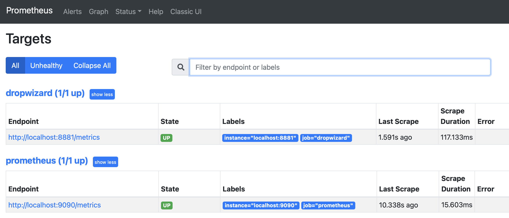
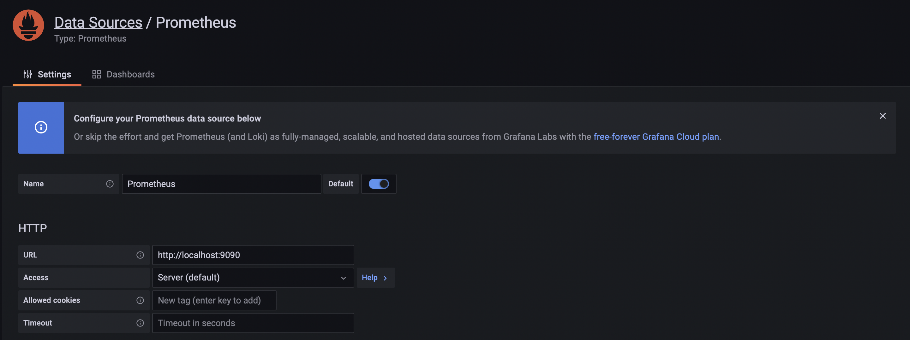
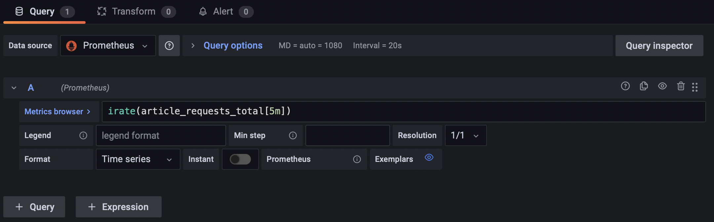
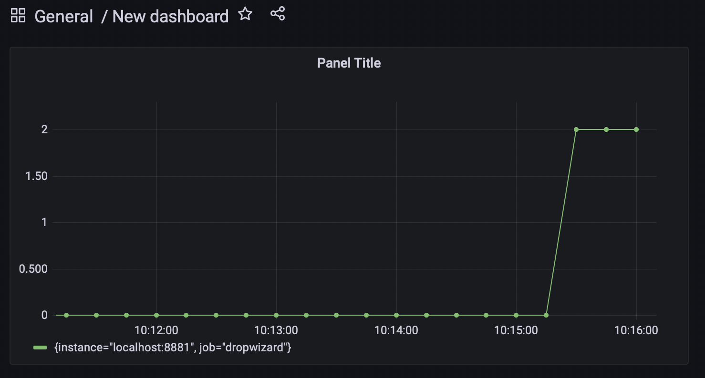

# Provenance metrics

In this exercise we'll look at introducing service level indicators within the Provenance codebase.

### The Exercise

Capture Provenance metrics!

- create a Prometheus job
- using Grafana, create a Prometheus data source
- create a Grafana dashboard

### Quick start

After downloading the codebase, you'll notice that the `provenance-metrics` project includes a few example metrics.
Search for `article-requests` to review the `Meter` metric.

Then review the Dropwizard [metrics](https://metrics.dropwizard.io/) Getting Started page to gain a general understanding of
the new code. Dropwizard Metrics is a Java framework for developing ops-friendly, high-performance, RESTful web
services built by Coda Hale and the engineering crew at Yammer.

Build the provenance-metrics project.

 ```bash
./gradlew clean build
 ```

Run the server using the below command.

```bash
java -jar applications/provenance-server/build/libs/provenance-server-1.0-SNAPSHOT.jar
```

### Prometheus

We'll be using [Prometheus](https://prometheus.io/) to store our metrics data. Prometheus is an open-source monitoring
application built by the engineers at SoundCloud.

Install Prometheus and ensure that Prometheus is configured with our new metrics endpoint.

```bash
brew install prometheus
```

Modify `/usr/local/etc/prometheus.yml` to match the example below. For homebrew modify `/opt/homebrew/etc/prometheus.yml`.

```yaml
  - job_name: 'dropwizard'
    metrics_path: '/metrics'
    scrape_interval: 5s
    scheme: http
    static_configs:
      - targets: [ 'localhost:8881' ]
```

Restart prometheus.

```bash
brew services restart prometheus
```

Upon success, you should see our Dropwizard endpoint `http://localhost:8881/metrics` **UP** on the
Prometheus [Status Targets](http://localhost:9090/targets) page.



### Grafana

Grafana allows you to query, visualize and alert on metrics from a variety of data sources. We'll be
using [Grafana](https://grafana.com/) to display our metrics data stored in Prometheus.

First, install and run Grafana.

```bash
brew install grafana
brew services restart grafana
```

Then use the [web application](http://localhost:3000) provided by Grafana to set up and
configure our Prometheus data source.



Add your newly created prometheus data source `http://localhost:3000/datasources/new`. Use `http://localhost:9090` for your grafana data source http url.

Next, create a new dashboard and graph our `article_requests_total` data.

Use the query below to display requests per second.

```
irate(article_requests_total[5m])
```



Curl the provenance articles endpoint to start tracking metrics. User a bash script similar to the example below to drive
multiple requests per second.

```bash
while [ true ]; do for i in {1..10}; do curl -v -H "Accept: application/json" http://localhost:8881/articles; done; sleep 5; done
``` 

Your dashboard should start recording data.



Capture a screenshot of your Prometheus targets page and Grafana dashboard to complete the exercise. 

Hope you enjoy the exercise!

Thanks,

The IC Team

© 2022 by Initial Capacity, Inc. All rights reserved.